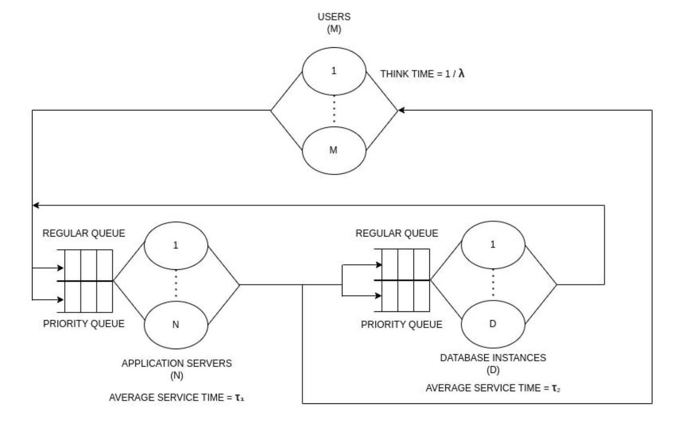

# **DISCRETE EVENT SIMULATOR FOR PRIORITY TANDEM QUEUE**

Discrete Event Simulator for measuring characteristics of a custom web server modeled as a closed-loop tandem queuing system having **N** application server and **D** database instances in order to capture model behaviours.  

# System Design

# Running the simulator
- Run the code with the following command-line arguments:  
 -<b>app_servers</b>: Number of application servers  
 -<b>db_servers</b>: Number of database servers  
 -<b>app_server_service_time</b>: Service time of application servers  
 -<b>db_server_service_time</b>: Service time of database servers  
 -<b>app_to_db_server_probability</b>: Probability of request going to database server from application server  
 -<b>simulation_time</b>: Number of application servers  
 -<b>num_client</b>: Number of application servers  
 -<b>think_time</b>: Think time of client  
 -<b>priority_probability</b>: Probability of request being a priority request    
 - Command to run:  
   `python --app_servers <app_servers> --db_servers <db_servers> --app_server_service_time <app_server_service_time> --db_server_service_time <db_server_service_time> --app_to_db_server_probability <app_to_db_server_probability> --simulation_time <simulation_time> --num_client <num_client> --think_time <think_time> --priority_probability <priority_probability>`    
 - For instance:  
    `python main.py --app_servers 2 --db_servers 2 --app_server_service_time 0.01 --db_server_service_time 0.1 --app_to_db_server_probability 0.3 --simulation_time 10 --num_client 10000 --think_time 5 --priority_probability 0.2`
